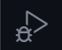
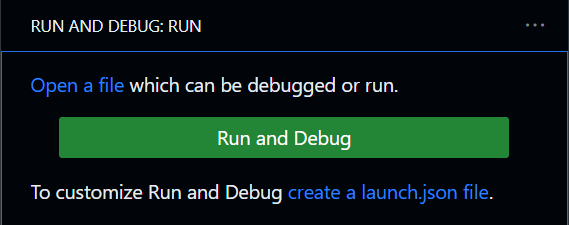
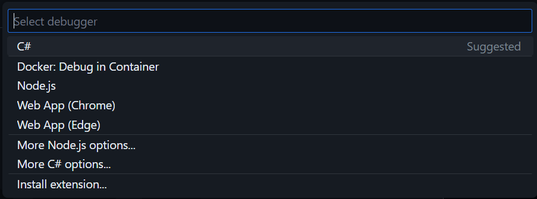
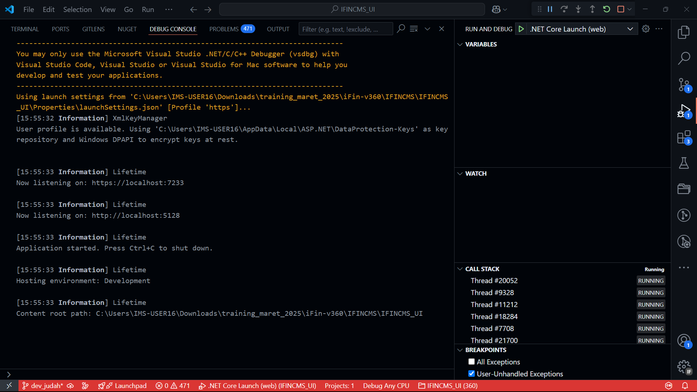
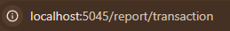

# 📌 Step-by-Step Clone Project dan Konfigurasi Branch

## 🛠️ 1. Clone Repository
Ketika masuk ke modul baru dan ingin melakukan clone project, jalankan perintah berikut:

```sh
git clone <repo-url>
```

## 🌿 2. Setup Branch
Setelah cloning selesai, secara default kamu akan berada di branch `master`. Selanjutnya, buat dua branch: `Staging` dan `magang_<nama pribadi>`.

```sh
git switch -c Staging
```

🔄 Tarik perubahan terbaru dari branch `Staging` yang ada di GitHub:

```sh
git pull origin Staging
```

> **💡 Catatan:** Branch `Staging` berfungsi sebagai branch penghubung sebelum masuk ke `master`. Bisa saja ada perubahan yang belum dipublish, jadi pastikan untuk menarik update terbaru.

Selanjutnya, buat branch pribadi untuk pengerjaan:

```sh
git switch -c magang_<nama pribadi>
git push origin magang_<nama pribadi>
```

> **⚠️ Catatan:** Branch `magang_<nama pribadi>` adalah branch tempat kamu mengerjakan tugasmu. Jangan melakukan perubahan langsung di `Staging`.

Langkah-langkah ini berlaku untuk project **UI** dan **API**.

## 📝 3. Konfigurasi File `.env`
Setelah branch dikonfigurasi, buat file `.env` sesuai dengan lokasi berikut:

### 🎨 UI
📂 Buat file `.env` di **root folder project** dengan isi berikut:

```env
MODULE="[MODULE_NAME]"
IFINBASE="http://147.139.191.88/api/"
IFINSYS="http://147.139.191.88:7000/ifinsys/api/"
IFINCORE="http://147.139.191.88:7000/ifincore/api/"
IFINCMS="http://147.139.191.88:7000/ifincms/api/"
IFINSLIK="http://147.139.191.88:7000/ifinslik/api/"
IFINSIPP="http://147.139.191.88:7000/ifinsipp/api/"
IFINLOS="http://147.139.191.88:7000/ifinlos/api/"
IFINDOC="http://147.139.191.88:7000/ifindoc/api/"
IFINSVY="http://147.139.191.88:7000/ifinsvy/api/"
IFINSCR="http://147.139.191.88:7000/ifinscr/api/"
IFINLGL="http://147.139.191.88:7000/ifinlgl/api/"
IFININS="http://147.139.191.88:7000/ifinins/api/"
IFINPBS="http://147.139.191.88:7000/ifinpbs/api/"
IFINPDC="http://147.139.191.88:7000/ifinpdc/api/"
IFINAPV="http://147.139.191.88:7000/ifinapv/api/"
```

### 🖥️ API
📂 Buat file `.env` di dalam folder `/API` yang berada di root folder project:

```env
 DATABASE_TYPE=PostgreSQL
 DATABASE_CONNECTION_STRING=Host=8.215.18.204;Username=postgres;Password=Nimda321;Database=[MODULE_NAME]

# DATABASE_TYPE=SqlServer
# DATABASE_CONNECTION_STRING="Server=8.215.18.204,1444; Database=[MODULE_NAME]; User ID=sa; Password=Nimda321; Connection Timeout=0; Persist Security Info=true"

#DATABASE_TYPE=MySql
#DATABASE_CONNECTION_STRING="server=localhost;uid=dbuser;pwd=dbuser;database=eis;"

#DATABASE_TYPE=Oracle
#DATABASE_CONNECTION_STRING="User ID=dbuser;Password=dbuser;Data Source=(DESCRIPTION=(ADDRESS=(PROTOCOL=TCP)(HOST=localhost)(PORT=1521))(CONNECT_DATA=(SERVICE_NAME=eis)))"


CLAIM_KEY=TX-PRIME
BOOTSTRAP_SERVER=localhost:9092
SECRET_KEY=IFINANCING-360-SUPER-SECRET-KEY-@&*%
KEY=IMS-Super-Secret
IV=1234567890123456
FILE_STORAGE=Storage

IFINAPV=http://147.139.191.88:7000/ifinapv/api
IFINSCR=http://147.139.191.88:7000/ifinscr/api
IFINSVY=http://147.139.191.88:7000/ifinsvy/api
IFINSYS=http://147.139.191.88:7000/ifinsys/api
```

## 🚀 4. Menjalankan Aplikasi
Setelah menambahkan file `.env`, jalankan aplikasi dengan dua metode: **via terminal** atau **debug mode**.

### 🎭 UI
- **▶️ Run via terminal:**
  ```sh
  dotnet watch
  ```
- **🐞 Debug Mode:**
  - Di sidebar, buka tab `Run and Debug`  
  
  - Click button `Rund and Debug`
  
  - Pilih `C#`
  
  - Pilih `C#: IFinancing360_CMS_UI [Default Configuration]`
  
  - *Starting the engine..*
  
  - Tunggu sampai *Application started..*
  

### 🏗️ API
- **▶️ Run via terminal:**
  ```sh
  dotnet watch -p API
  ```
- **🐞 Debug Mode:**
  - Buka tab `Run and Debug`  
  
  - Click button `Rund and Debug`
  
  - Pilih `C#`
  
  - Pilih `C#: API`
  
  - *Starting the engine..*
  
  - Tunggu sampai *Application started..*
  
  - Ketika API-nya sudah run, `Swagger` akan muncul automatis di web browser (biasanya akan langsung redirect ke browser)
  