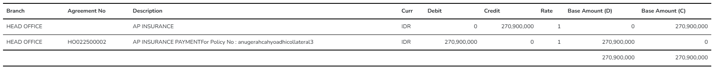

-   tambahin template HTML
    Disclaimer: emplate ini sebagai contoh, karena tampilan di previewnya nanti bisa berbeda tergantung request/kebutuhan

-   pertama, pastikan sudah mendaftarkan path template di `.env` (kalo udah ada gausah ditambahin lagi ya :))

```env
REPORT_TEMPLATE_PATH=..\ReportTemplate
```

-   kedua, buat file (`.html`) baru di folder `/ReportTemplate`, untuk penamaan file bebas tergantung nama reportnya
    

-   ini hanya sebagai contoh isi dari template html, tambahkan css-nya di tag style di dalam header
    tip: jika mau buat template html bisa buat di codepen (<a href="https://codepen.io/pen/">click here</a>).

```html
<!DOCTYPE html>
<html lang="en">
    <head>
        <meta charset="UTF-8" />
        <meta
            name="viewport"
            content="width=device-width, initial-scale=1.0"
        />
        <title>Journal Transaction</title>
        <style>
            body {
                font-family: "Times New Roman", Times, serif;
            }

            .text-center {
                text-align: center !important;
            }

            .text-right {
                text-align: right !important;
            }

            .container {
                width: 80%;
                margin: 0 auto;
            }

            .container .header h1 {
                text-align: center;
            }

            .header,
            .section {
                margin-bottom: 20px;
            }

            .section h2 {
                margin-bottom: 10px;
                font-weight: 700;
                font-size: 24px;
            }

            .section.information {
                margin-bottom: 50px;
            }

            .section p {
                margin: 5px 0;
                font-size: 14px;
                padding-top: 3px;
            }

            table {
                width: 100%;
                border-collapse: collapse;
                margin-top: 20px;
            }

            table,
            th,
            td {
                border: 1px solid black;
            }

            th,
            td {
                padding: 8px;
                text-align: left;
            }
        </style>
    </head>

    <body>
        <div class="container">
            <div>
                <p
                    style="text-align: center;font-size: 20px; font-weight: bold;"
                >
                    {{CompanyName}}
                </p>
                <p
                    style="text-align: center;font-size: 18px; font-weight: bold;"
                >
                    {{HeaderName}}
                </p>
                <br />
            </div>
            <br />
            <div class="section-information">
                <p
                    style="font-size: 16px; font-weight: bold;margin-bottom: 6px;"
                ></p>
                <div>
                    <table
                        style="border: none; border-collapse: collapse; width: 100%;"
                        class="data-information"
                    >
                        <tr style="border: none; ">
                            <td style="border: none;width: 30%;">Reff No</td>
                            <td
                                style="border: none;width: 5%;text-align: center;"
                            >
                                :
                            </td>
                            <td style="border: none;width: 30%;">
                                {{ReffSourceNo}}
                            </td>
                            <td style="border: none;width: 30%;">
                                Transaction Date
                            </td>
                            <td
                                style="border: none;width: 5%;text-align: center;"
                            >
                                :
                            </td>
                            <td style="border: none;width: 30%;">
                                {{TransactionDate}}
                            </td>
                        </tr>
                        <tr style="border: none; ">
                            <td style="border: none;width: 30%;">Editor</td>
                            <td
                                style="border: none;width: 5%;text-align: center;"
                            >
                                :
                            </td>
                            <td style="border: none;width: 30%;">{{Editor}}</td>
                            <td style="border: none;width: 30%;">Input Date</td>
                            <td
                                style="border: none;width: 5%;text-align: center;"
                            >
                                :
                            </td>
                            <td style="border: none;width: 30%;">
                                {{InputDate}}
                            </td>
                        </tr>
                        <tr style="border: none; ">
                            <td style="border: none;width: 30%;">Remarks</td>
                            <td
                                style="border: none;width: 5%;text-align: center;"
                            >
                                :
                            </td>
                            <td style="border: none;width: 30%;">
                                {{Remarks}}
                            </td>
                            <td style="border: none;width: 30%;"></td>
                            <td
                                style="border: none;width: 5%;text-align: center;"
                            ></td>
                            <td style="border: none;width: 30%;"></td>
                        </tr>
                    </table>
                </div>
            </div>
        </div>
        <div>
            <br />
        </div>

        <!-- Section D A T A -->
        <div>
            <div style="padding-top: 18px;">
                <div id="dynamicData">
                    <!-- Data -->
                </div>
            </div>
        </div>
        <!-- Section D A T A -->

        <div
            style="display: flex; justify-content: flex-end; margin-top: 20px;"
        >
            <table style="border:1px solid black; width: 50%;">
                <thead>
                    <tr>
                        <th
                            style="font-weight:bold; width: 25%; text-align: center;"
                        >
                            Prepared
                        </th>
                        <th
                            style="font-weight:bold; width: 25%; text-align: center;"
                        >
                            Checked
                        </th>
                        <th
                            style="font-weight:bold; width: 25%; text-align: center;"
                        >
                            Approved
                        </th>
                        <th
                            style="font-weight:bold; width: 25%; text-align: center;"
                        >
                            Posted
                        </th>
                    </tr>
                </thead>
                <tbody>
                    <tr>
                        <td
                            style="text-align:left; width: 25%; height: 70px;"
                        ></td>
                        <td
                            style="text-align:left; width: 25%; height: 70px;"
                        ></td>
                        <td
                            style="text-align:left; width: 25%; height: 70px;"
                        ></td>
                        <td
                            style="text-align:left; width: 25%; height: 70px;"
                        ></td>
                    </tr>
                </tbody>
            </table>
        </div>
    </body>
</html>
```

-   ambil data di repository
    ingat tidak ada yang menjamin data diambil dari 1 sumber (repo) bisa 2/lebih, contoh di bawah biar ga bingung aja

```cs
#region GetRowsByGLLinkID
  public async Task<List<JournalGlLinkTransactionDetail>> GetRowsByGLLinkID(IDbTransaction transaction, string GlLinkTransactionID)
  {
    var p = db.Symbol();

    string query = $@"
              select
                  id                      as ID
                  ,gl_link_transaction_id	as GlLinkTransactionID
                  ,branch_id				      as BranchID
                  ,branch_code			      as BranchCode
                  ,branch_name			      as BranchName
                  ,gl_link_id				      as GlLinkID
                  ,gl_link_code			      as GlLinkCode
                  ,gl_link_name			      as GlLinkName
                  ,contra_gl_link_id		  as ContraGlLinkID
                  ,contra_gl_link_code	  as ContraGlLinkCode
                  ,contra_gl_link_name	  as ContraGlLinkName
                  ,agreement_no			      as AgreementNo
                  ,orig_currency_id		    as OrigCurrencyID
                  ,orig_currency_code		  as OrigCurrencyCode
                  ,orig_currency_desc		  as OrigCurrencyDesc
                  ,orig_amount_db			    as OrigAmountDb
                  ,orig_amount_cr			    as OrigAmountCr
                  ,exch_rate				      as ExchRate
                  ,base_amount_db			    as BaseAmountDb
                  ,base_amount_cr			    as BaseAmountCr
                  ,remarks				        as Remarks
                  ,division_id			      as DivisionID
                  ,division_code			    as DivisionCode
                  ,division_name			    as DivisionName
                  ,department_id			    as DepartmentID
                  ,department_code		    as DepartmentCode
                  ,department_name		    as DepartmentName
              from
                  {tableBase}
              where
                  gl_link_transaction_id = {p}GlLinkTransactionID
              order by
                  cre_date desc ";

    object parameters = new
    {
      GlLinkTransactionID = GlLinkTransactionID
    };

    var result = await _command.GetRows<JournalGlLinkTransactionDetail>(transaction, query, parameters);
    return result;
  }
  #endregion
```

-   tambahin logic di controller, service
-   di sinilah tempat semua data diambil (dari repo) lalu dimasukan (replace) ke dalam template html

```cs
#region PreviewHTML
public async Task<string> GetHTMLPreview(string Code, string CompanyName, List<JsonObject> Employee)
{
    using var connection = _repo.GetDbConnection();
    using var transaction = connection.BeginTransaction();

    try
    {
      // Ambil isi file template HTML
      string envPath = Env.GetString("REPORT_TEMPLATE_PATH");
      string templatePath = Path.Combine(envPath, "JournalTransaction.html");
      string htmlContent = await File.ReadAllTextAsync(templatePath);

      // Isi data untuk table atas (ada keterangan table atas di bawah code snippet, ingat ini hanya contoh)
      var offeringLetter = await _repo.GetRowByReffSourceNo(transaction, Code!);

      if (offeringLetter == null) throw new Exception("Journal doest exists");

      var employee = Employee.Find(x => x["Code"]?.GetValue<string>() == offeringLetter.ModBy);

      string EmployeeName = "";
      if (employee != null)
      {
          EmployeeName = employee["Name"]?.GetValue<string>() ?? "";
      }
      string Remarks = $"{offeringLetter.TransactionName} with code {Code}";

      // Data dinamis yang ingin disuntikkan ke dalam template
      var parameters = new Dictionary<string, string>
      {
          { "CompanyName", CompanyName },
          { "HeaderName", "Journal Transaction" },
          { "ReffSourceNo", offeringLetter.ReffSourceNo! },
          { "Editor", EmployeeName },
          { "Remarks", Remarks! },
          { "InputDate", offeringLetter.InputDate?.ToString("dd/MM/yyyy")! },
          { "TransactionDate", offeringLetter.TransactionDate?.ToString("dd/MM/yyyy")! },
          { "root", envPath }
      };

      // Gantikan placeholder dengan nilai dari dictionary
      foreach (var parameter in parameters)
      {
          string placeholder = $"{{{{{parameter.Key}}}}}";
          htmlContent = htmlContent.Replace(placeholder, parameter.Value);
      }


      // Isi data di table bawah (ada keterangan table bawah di bawah code snippet, ingat ini hanya contoh)
      List<JournalGlLinkTransactionDetail> amortizationCalculates = await _repoJournalGlLinkTransactionDetail.GetRowsByGLLinkID(transaction, offeringLetter.ID!);
      amortizationCalculates = amortizationCalculates.ToList();

      var baseAmount = await _repoJournalGlLinkTransactionDetail.GetSumBaseAmount(transaction, offeringLetter.ID!);

      string queryHtml = string.Empty;

      // Menambahkan heading untuk tenor
      queryHtml += $@"
              <table style=""border-collapse: collapse; width: 100%; border:none"">
                  <thead>
                      <tr style=""border-top: 2px solid black; border-bottom: 2px solid black;"">
                          <th style=""font-weight:bold; padding: 8px; border: none;"">Branch</th>
                          <th style=""font-weight:bold; padding: 8px; border: none;"">Agreement No</th>
                          <th style=""font-weight:bold; padding: 8px; border: none;"">Description</th>
                          <th style=""font-weight:bold; padding: 8px; border: none;"">Curr</th>
                          <th style=""font-weight:bold; padding: 8px; border: none;"">Debit</th>
                          <th style=""font-weight:bold; padding: 8px; border: none;"">Credit</th>
                          <th style=""font-weight:bold; padding: 8px; border: none;"">Rate</th>
                          <th style=""font-weight:bold; padding: 8px; border: none;"">Base Amount (D)</th>
                          <th style=""font-weight:bold; padding: 8px; border: none;"">Base Amount (C)</th>
                      </tr>
                  </thead>
                  <tbody>";
      foreach (var item in amortizationCalculates)
      {
          queryHtml += $@"
                      <tr style=""border-bottom: 1px solid black;"">
                          <td style=""text-align:left;  border: none;"">{item.BranchName}</td>
                          <td style=""text-align:left;  border: none;"">{item.AgreementNo}</td>
                          <td style=""text-align:left;  border: none;"">{item.Remarks}</td>
                          <td style=""text-align:left;  border: none;"">{item.OrigCurrencyCode}</td>
                          <td style=""text-align:right; border: none;"">{item.OrigAmountDb:N0}</td>
                          <td style=""text-align:right; border: none;"">{item.OrigAmountCr:N0}</td>
                          <td style=""text-align:right; border: none;"">{item.ExchRate:N0}</td>
                          <td style=""text-align:right; border: none;"">{item.BaseAmountDb:N0}</td>
                          <td style=""text-align:right; border: none;"">{item.BaseAmountCr:N0}</td>
                      </tr>";
      }
      queryHtml += $@"
                      <tr style=""border-top: 2px solid black; border-bottom: 2px solid black;"">
                          <td style=""text-align:right; border: none;""></td>
                          <td style=""text-align:right; border: none;""></td>
                          <td style=""text-align:right; border: none;""></td>
                          <td style=""text-align:right; border: none;""></td>
                          <td style=""text-align:right; border: none;""></td>
                          <td style=""text-align:right; border: none;""></td>
                          <td style=""text-align:right; border: none;""></td>
                          <td style=""text-align:right; border: none;"">{baseAmount.BaseAmountDb:N0}</td>
                          <td style=""text-align:right; border: none;"">{baseAmount.BaseAmountCr:N0}</td>
                      </tr>
                  </tbody>
              </table>";


      htmlContent = htmlContent.Replace("<!-- Data -->", queryHtml);
      return htmlContent;
    }
    catch (Exception)
    {
      transaction.Rollback();
      throw;
    }
}
#endregion
```

keterangan:
- table atas


- table bawah



- controller
ingat ini hanya contoh
```cs
[HttpGet("GetHTMLPreview")]
public async Task<ActionResult> GetPreview(string ReffNo)
{
  try
  {
    var headers = Request.Headers.ToDictionary(x => x.Key, x => x.Value.ToString());
    var company = await _internalAPIClient.GetRow("IFINSYS", "SysCompany", "GetCompany", null, headers: headers);
    string CompanyName = "";
    if (company.Data != null)
    {
      CompanyName = company.Data["Name"]?.GetValue<string>()!;
    }

    var emp = await _internalAPIClient.GetRows("IFINSYS", "SysEmployeeMain", "GetRows", parameters: new { keyword = "", offset = 0, limit = int.MaxValue }, headers: headers);

    var employee = emp.Data;

    var result = await _service.GetHTMLPreview(ReffNo, CompanyName, employee ?? []);
    return ResponseSuccess(new { HTML = result });
  }
  catch (Exception ex)
  {
    return ResponseError(ex);
  }
}
```
notes: dalam kasus tertentu tidak harus menggunakan `_internalAPIClient`, itu hanya diperlukan ketika butuh ngambil/tarik data dari module lain

-   tambahin button di UI
sekarang ke UI, tambahkan component button dan functionnya (untuk ambil template yang sudah diisi data)

