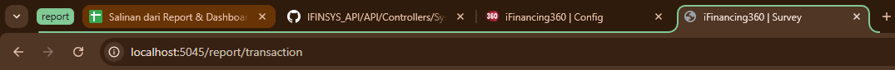
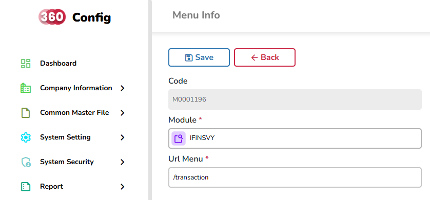

# 📄 Langkah Implementasi Report

## Setup awal (Screen - Config)

### 1. Buat `DataGrid` Component

**Tujuan:** Menampilkan daftar report berdasarkan modul (misalnya `Report > Transaction`).

#### 🔍 Cek Submenu

-   Pastikan sudah ada submenu `Transaction` di menu `Report`.
-   Kalau belum, ikuti langkah-langkah berikut:

#### 🧾 Daftarin Role Access

-   Tambahkan konfigurasi akses di **Config (IFINSYS)**.
    -   Contoh:
        
        

## UI

#### ⚙️ Buat Komponen `DataGrid`

**Struktur folder:**

```txt
Components
└── Report
    └── TransactionComponent
        └── TransactionDataGrid.razor / .razor.cs
```

`


##### TransactionDataGrid.razor

```razor
<RadzenStack Gap="16">
  <DataGrid ID="TransactionDataGrid"
            @ref="@dataGrid"
            TItem="JsonObject"
            LoadData="LoadData"
            AllowSelected="true"
            // [comment ini dihapus] $"/systemsetting/menu -> path-nya disesuaikan dengan route (@page) di halaman list (kalo bingung tanya)
            RowLink=@((row) => $"/systemsetting/menu/{row["ReportCode"]?.ToString()}/{ParamReportName}")>

    <Columns>
      <DataGridColumn TItem="JsonObject" Property="ReportName" Title="Report Name" Width="100%" />
    </Columns>

  </DataGrid>
</RadzenStack>
```

##### TransactionDataGrid.razor.cs

```cs
using System.Text.Json.Nodes;
using iFinancing360.UI.Components;
using iFinancing360.UI.Helper.APIClient;
using Microsoft.AspNetCore.Components;

namespace IFinancing360_ACC_UI.Components.Report.TransactionComponent
{
  public partial class TransactionDataGrid
  {
    #region Service
    [Inject] IFINSYSClient IFINSYSClient { get; set; } = null!;
    #endregion

    #region Component field
    DataGrid<JsonObject> dataGrid = null!;
    #endregion

    #region ParamReportName
    public string ParamReportName(JsonObject row)
    {
      var myStr = string.Join('_', (row["ReportName"]?.GetValue<string>() ?? "").Split(' ', StringSplitOptions.RemoveEmptyEntries));

      return myStr;
    }
    #endregion

    #region LoadData
    protected async Task<List<JsonObject>?> LoadData(DataGridLoadArgs args)
    {
      var res = await IFINSYSClient.GetRows<JsonObject>("SysUserMainReport", "GetRows", new { args.Keyword, args.Offset, args.Limit, userID = GetCurrentUser() });

      return res?.Data;
    }
    #endregion
  }
}
```

---

### 2. Buat `Form` Component

**Tujuan:** Menyediakan halaman filter/form berdasarkan `ReportCode`.
Per masing-masing report itu pasti punya halaman form yang berisi filter untuk data yang akan dicetak.

```razor
<TemplateForm>
  <RadzenStack Gap="16">
    <!-- #region Toolbar -->
    <RadzenRow Gap="8">
      <RoleAccess Code="">
        <ButtonPreview
            ButtonStyle="ButtonStyle.Info"
            Text="Print Voucher"
            Icon="Print"
            Template="@GetReportHTML" // [comment ini dihapus] Template untuk function review HTML
            PrintAs="ReportPrint" /> // [comment ini dihapus] PrintAs untuk function print reportnya
      </RoleAccess>

      <Button ButtonStyle="ButtonStyle.Danger" Text="Back" Click="Back" />
    </RadzenRow>
    <!-- #endregion -->

    <RadzenStack Gap="8">
      <RadzenRow Gap="32">


      <!-- !!! Cuma Template (bisa dihapus) !!! -->

      <!-- #region Accounting Period -->
        <FormFieldDatePicker Label="Accounting Period" Name="AccountingPeriod" Value=@(row["AccountingPeriod"]?.GetValue<DateTime>()) Required />
      <!-- #endregion -->

      <!-- #region Account No -->
      <FormFieldTextBox Label="Account No" Name="AccountNo" Value=@(row["AccountNo"]?.GetValue<string>()) Required />
      <!-- #endregion -->

      <!-- !!! Cuma Template (bisa dihapus) !!! -->


      </RadzenRow>
    </RadzenStack>
  </RadzenStack>
</TemplateForm>
```

#### 🧠 Catatan:

-   Field input bisa berbeda-beda tergantung kebutuhan report (lihat di Google Sheet).
-   Komponen ini dibuat per report, dan untuk komponen, foldernya dibedain dengan TransactionComponent dan format penamaan => '[ReportName]Component'.

**Struktur folder:**

```txt
Components
└── Report
    └── TransactionComponent
        └── TransactionDataGrid.razor / .razor.cs
    └── [ReportName]Component
        └── [ReportName]Form.razor / .razor.cs
```

```cs
using System.Text.Json.Nodes;
using iFinancing360.UI.Helper.APIClient;
using Microsoft.AspNetCore.Components;

namespace IFinancing360_[MODULE]_UI.Components.Report.[ReportName]Component
{
  public partial class [ReportName]Form
  {
    #region Service
    [Inject] IFINSYSClient IFINSYSClient { get; set; } = null!;
    #endregion

    #region Parameter
    [Parameter, EditorRequired] public string? ReportCode { get; set; }
    #endregion

    #region Class field
    private const string BASE_PATH = "/path/ke/halaman/report/list"; // itu perhatiin lagi path-nya (kurang jelas tanya)

    public JsonObject row = [];
    #endregion

    #region API Controllers & routes
    //controllers
    private string APIController = "";
    //routes
    private string APIRouteFor = "";
    #endregion

    #region OnInit
    protected override async Task OnParametersSetAsync()
    {
      await base.OnParametersSetAsync();
    }
    #endregion

    #region Back
    public void Back()
    {
      NavigationManager.NavigateTo(BASE_PATH);
    }
    #endregion

    /*
        [comment ini dihapus]
        IFINFINClient itu diganti dengan module/service sekarang
        ControllerName, RouteName => bisa disesuaikan untuk function yang mengembalikan html content dan data reportnya yg ada di API
    */
    #region GetReportHTML
    private async Task<string> GetReportHTML()
    {
      Loading.Show();

      var result = await IFINFINClient.GetRow("ControllerName", "RouteName", new { ReffNo = row["Code"]?.GetValue<string>() });
      string html = result?.Data["HTML"]?.GetValue<string>();

      Loading.Close();

      return html;
    }
    #endregion

    #region ReportPrint
    private async Task ReportPrint(string mimeType)
    {
      Loading.Show();

      var result = await IFINFINClient.GetRow("ControllerName", "RouteName", new { MimeType = mimeType, ReffNo = row["Code"]?.GetValue<string>() });

      if (result?.Data != null)
      {
        var data = result.Data;

        var Content = data["Content"]?.GetValueAsByteArray();
        var FileName = data["Name"]?.GetValue<string>();
        var MimeType = data["MimeType"]?.GetValue<string>();

        PreviewFile(Content, FileName, MimeType);

        Loading.Close();
      }
    }
    #endregion
  }
}
```

### 3. Buat `List Page` dan `Form Page`

---

#### 📄 List Page


**Struktur folder:**

```txt
Pages
└── Report
    └── TransactionPage
        └── TransactionList.razor
```

```razor
@page "/report/reporttransaction"

@using IFinancing360_ACC_UI.Components.Report.TransactionComponent

<ReleaseLock />

<Title Text="Report Transaction" />

<RoleAccess Code="">
  <PageContainer>
    <TransactionDataGrid />
  </PageContainer>
</RoleAccess>
```

> Notes: @page itu isinya path/route yang bisa kita lihat di search bar  
> Tujuan dari route: itu sama kayak alamat mantan, kalo lu mau balikin barang mantan butuh alamat kan, sama kyk component kalo mau dia muncul, tulis alamatnya/path

```razor
@page "/report/reporttransaction"
```



> Untuk ngambil route dimana bang?
> Di config (IFINSYS) ada setting untuk menu

## 

> Perhatiin juga URL menu si Parent (menu), jangan cuman Child (submenu) doang

---

#### 🧾 Form Page Berdasarkan ReportCode


**Struktur folder:**

```txt
Pages
└── Report
    └── TransactionPage
        └── TransactionList.razor
        └── TransactionInfo.razor
```

Untuk component yang dirender akan tergantung pada **report code** yang diberikan lewat **route param**.

```razor
@page "/report/reporttransaction/{ReportCode}/{ReportName}"

@using IFinancing360_ACC_UI.Components.Report.TrialBalanceReportComponent

<Title Text=@FormattedReportName />

<RoleAccess Code="">
  <PageContainer>

    @if (ReportCode == "trial_balance")
    {
      <TrialBalanceReportForm ReportCode=@ReportCode />
    } else {
      @* Kondisi kedua dan seterusnya *@
    }

  </PageContainer>
</RoleAccess>

@code {
  [Parameter] public string? ReportCode { get; set; }
  [Parameter] public string? ReportName { get; set; }

  public string? FormattedReportName =>
  string.Join(' ', ReportName.Split('_')) ?? "Report Transaction Info";
}
```

---

### 4. Tambahkan Template HTML untuk Report

> Disclaimer: emplate ini sebagai contoh, karena tampilan di previewnya nanti bisa berbeda tergantung request/kebutuhan

#### ✅ Setup `.env`

Pastikan sudah ada path ke folder template di `.env` (kalo udah ada gausah ditambahin lagi ya :))

```env
REPORT_TEMPLATE_PATH=..\ReportTemplate
```

## API

#### 📁 Buat File `.html` Template

-   Lokasi: `/ReportTemplate`
-   Nama file bebas, sesuaikan dengan nama report-nya.


-   Template hanya dibuat 1x, jadi hanya ada 1 per module, yang berubah itu datanya dan berubah di service

```html
<!DOCTYPE html>
<html lang="id">
    <head>
        <meta charset="UTF-8" />
        <meta
            name="viewport"
            content="width=device-width, initial-scale=1.0"
        />
        <title>Dokumen Contoh</title>
        <style>
            body {
                font-family: Arial, sans-serif;
                margin: 0;
                padding: 14px;
                font-size: 14px;
            }

            p,
            h1,
            h2,
            h3 {
                padding: 0;
                margin: 0;
            }

            header {
                display: flex;
                gap: 32px;
                justify-content: space-between;
                align-items: center;
                border-bottom: 1px solid #838383;
                padding-bottom: 14px;
            }

            header img {
                height: 80px;
            }

            header .header-main-info {
                display: flex;
                flex-direction: column;
                align-items: center;
                gap: 12px;
            }

            .header-main-info p {
                font-size: 1em;
            }

            .header-main-info p span {
                font-weight: bold;
                font-size: 1rem;
            }

            header .report-print-date {
                font-size: 1em;

                padding: 8px 14px;
                border-radius: 8px;
                border: 1px solid #5b5b5b;

                display: flex;
                flex-direction: column;
                gap: 8px;
            }

            main {
                padding-bottom: 32px;
            }

            table {
                font-size: 1em;

                width: 100%;
                min-width: 1080px;
                border-collapse: collapse;
                margin-top: 14px;
            }

            table,
            th,
            td {
                border: 1px solid #bdc3c7;
            }

            th,
            td {
                padding: 6px;
            }

            th {
                background-color: #c6dcfe;
            }

            footer {
                position: relative;
                bottom: 0;
                left: 14px;
                right: 14px;
                padding: 14px 0;
                font-size: 0.85em;
                border-top: 1px solid #8c8c8c;
                display: flex;
                justify-content: space-between;
            }

            .watermark-container {
                position: absolute;
                top: 100px;
                /* jarak dari atas halaman, bisa kamu sesuaikan */
                left: 0;
                width: 100%;
                text-align: center;
                z-index: 0;
                /* pastikan di belakang isi tabel */
            }

            .watermark-logo {
                max-width: 500px;
                width: 60%;
                opacity: 0.06;
                /* transparansi lembut */
                filter: blur(1px);
                /* biar agak halus */
                pointer-events: none;
                /* biar ga ganggu klik */
            }
        </style>
    </head>

    <body>
        <div class="watermark-container">
            
        </div>

        <header>
            

            <!-- Data di header disesuaikan sesuai dengan report masing-masing -->
            <div class="header-main-info">
                <h2>PT. INOVASI MITRA SEJATI</h2>
                <!-- Report Name -->
                <h3>REPORT TRIAL BALANCE</h3>
                <!-- Header Information (Kosongkan jika tidak ada) -->
                <p>
                  Accounting Period: <span>dd/MM/yyyy-dd/MM/yyyy</span> -
                    Account No: <span>################</span>
                </p>
            </div>
            <div class="report-print-date">
                <p style="font-weight: bold;">Print Date:</p>
                <!-- Print Date (Format harus sama) -->
                <p>Thursday, February 3 2025</p>
                <!-- Print Time (Format harus sama) -->
                <p>11:05 AM (GMT +7)</p>
            </div>
        </header>

        <main>
          <!-- Data -->
        </main>

        <footer>
            <p>&copy; 2025 PT. Web Dev Ceria. All rights reserved.</p>
            <p style="text-align: right;">
                (021) 39730397 <br />
                Alam Sutera, 5th Floor, Suite 01-17 The Smith @, RT.002/RW.003,
                Kunciran, Kec. Pinang, Kota Tangerang, Banten 15315
            </p>
        </footer>
    </body>
</html>
```

> Pro Tip: Mau ngedesain HTML lebih gampang? Gunain [CodePen](https://codepen.io/pen/) buat preview cepat!

---

### Struktur dan Pengambilan Data (Repository)

> ⚠️ **Catatan**: Data yang digunakan dalam report _tidak selalu_ berasal dari satu repository. Bisa lebih dari satu, tergantung kebutuhan. Jadi jangan asumsikan semuanya berasal dari satu source.

```cs
/*
- Function repo dibuat di repo dari table base saja
- Model tidak perlu dibuat baru, cukup menggunakan model dari table base saja
- Parameter berfungsi untuk filter data, jika tidak ada sisakan variable transaction saja
*/

#region GetRowsForReport
public async Task<List<SurveyMain>> GetRowsForReport(IDbTransaction transaction)
{
    var p = db.Symbol();

    string query = $@"
    select
        am.id                             AS ID
        ,am.code							            AS Code
        ,am.survey_result_date				    AS SurveyResultDate
        ,am.survey_result_amount			    AS SurveyResultAmount
        ,am.survey_result_remarks			    AS SurveyResultRemarks
        ,am.status							          AS Status
        ,am.survey_result_value				    AS SurveyResultValue
        ,am.return_count					        AS ReturnCount
        ,ar.code							            AS RequestNo
        ,ar.surveyor_id						        AS SurveyorID
        ,ar.reff_code						          AS ReffCode
        ,ar.reff_name						          AS ReffName
        ,ar.reff_object						        AS ReffObject
        ,ar.survey_fee_amount				      AS SurveyFeeAmount
        ,ar.contact_person_name				    AS ContactPersonName
        ,ar.application_no					      AS ApplicationNo
        ,ar.contact_person_area_phone_no  AS ContactPersonAreaPhoneNo
        ,ar.contact_person_phone_no			  AS ContactPersonPhoneNo
        ,ar.address							          AS Address
        ,ms.surveyor_name					        AS SurveyorName
        ,ms.is_external						        AS IsExternal
        ,am.survey_request_id             AS SurveyRequestID
    from
        {tableBase} am
      left join
          {tableBaseSurveyRequest} ar on (ar.id = am.survey_request_id)
      left join
          {tableBaseMasterSurveyor} ms on (ar.surveyor_id = ms.id)";

    var parameters = new { };

    var result = await _command.GetRow<SurveyMain>(transaction, query, parameters);
    return result;
}
#endregion
```

### 2. Implementasi Backend

#### 2.1 Tambahkan Logic di Layer Controller dan Service

-   Logic utama untuk mengambil data dari repository dan mengganti isi template HTML dilakukan di dalam service.
-   Controller hanya bertugas sebagai endpoint pemanggil service.

#### 2.2 Contoh Implementasi Service - `GetHTML...()`

```cs
/*
  [comment ini harus dihapus setelah dibaca!]

  Parameter dari function ini dapat berubah tergantung filter yang ada, jadi tidak harus selalu reffNo
  Jika tidak ada filternya, parameter dari functionnya bisa dihapus jadi kosong
*/

#region GetHTMLForReportName
public async Task<string> GetHTMLForReportName()
{
  using var connection = _repo.GetDbConnection();
  using var transaction = connection.BeginTransaction();

  try
  {
    string envPath = Env.GetString("REPORT_TEMPLATE_PATH");
    string templatePath = Path.Combine(envPath, "ReportTemplate.html");
    string htmlContent = await File.ReadAllTextAsync(templatePath);

    /*
      [comment ini harus dihapus setelah dibaca!]

      Untuk keterangan table atas, ada di bawah code snippet, Ingat ini hanya contoh!
      Data dinamis yang ingin dimasukan (replace) ke dalam template.

      Bagian ini untuk pengisian data header (table atas).
    */
    var parameters = new Dictionary<string, string>
    {
        { "Atribut_1", string.Empty },
    };

    foreach (var parameter in parameters)
    {
        string placeholder = $"{{{{{parameter.Key}}}}}";
        htmlContent = htmlContent.Replace(placeholder, parameter.Value);
    }

    /*
      [comment ini harus dihapus setelah dibaca!]

      Bagian ini untuk mengisi data ke tabel inti (table bawah) yang di ambil dari function repo.
    */
    List<ModelName> dataList = [];

    string queryHtml = string.Empty;

    queryHtml += $@"
      <table style=""border-collapse: collapse; width: 100%; border:none"">
          <thead>
              <tr style=""border-top: 2px solid black; border-bottom: 2px solid black;"">
                  <th style=""font-weight:bold; padding: 8px; border: none;"">Column 1</th>
                  <th style=""font-weight:bold; padding: 8px; border: none;"">Column 2</th>
              </tr>
          </thead>
          <tbody>";

    foreach (var item in dataList)
    {
        queryHtml += $@"
          <tr style=""border-bottom: 1px solid black;"">
              <td style=""text-align:left;  border: none;"">{item.Column1}</td>
              <td style=""text-align:left;  border: none;"">{item.Column2}</td>
          </tr>";
    }

    queryHtml += $@"
          </tbody>
      </table>";

    transaction.Commit();

    htmlContent = htmlContent.Replace("<!-- Data -->", queryHtml);
    return htmlContent;
  }
  catch (Exception)
  {
    transaction.Rollback();
    throw;
  }
}
#endregion

/*
  [comment ini harus dihapus setelah dibaca!]

  parameter dari function ini dapat berubah tergantung filter yang ada, jadi tidak harus selalu reffNo
  kalo tidak ada filternya, parameter dari functionnya sisakan mimeType karena parameter wajib
*/
#region GenerateDocumentAllType
public async Task<FileDoc> GenerateDocumentAllType(string mimeType)
{
  string htmlContent = GetHTMLForReportName();

  MemoryStream memoryStream = new();

  if (mimeType == null) throw new ArgumentNullException("Mime Type is null");

  if (mimeType == "Docx")
  {
      memoryStream = Report.ConvertHtmlToDocx(htmlContent);
      mimeTypetoReturn = "application/vnd.openxmlformats-officedocument.wordprocessingml.document";
  }
  if (mimeType == "Xlsx")
  {
      memoryStream = Report.ConvertHTMLtoExcel(htmlContent);
      mimeTypetoReturn = "application/vnd.openxmlformats-officedocument.spreadsheetml.sheet";
  }
  if (mimeType == "PDF")
  {
      mimeTypetoReturn = "application/pdf";
      memoryStream = Report.ConvertHtmlToDocx(htmlContent);

      byte[] docxBytes;
      using (var ms = new MemoryStream())
      {
          memoryStream.CopyTo(ms);
          docxBytes = ms.ToArray();
      }

      byte[] pdfBytes = await ConvertDocxToPDF(docxBytes);
      memoryStream = new MemoryStream(pdfBytes);
  }

  FileDoc fileDoc = new()
  {
      Content = memoryStream.ToArray(),
      Name = $"[REPORT_NAME].{mimeType}",
      MimeType = mimeTypetoReturn,
  };

  return fileDoc;
}
#endregion
```

keterangan:

-   Tabel atas => biasanya header untuk data perusahaan / report
    

-   Table bawah => isinya data intinya dan jumlahnya banyak
    

---

#### 2.3 Contoh Implementasi Controller

```cs
/*
  [comment ini harus dihapus setelah dibaca!]

  parameter dari function ini berisi filter, kalo tidak ada kosongkan saja
*/
[HttpGet("GetHTMLPreview")]
public async Task<ActionResult> GetPreview(string ReffNo)
{
    try
    {
        var result = await _service.GetHTMLPreview(ReffNo);
        return ResponseSuccess(new { HTML = result });
    }
    catch (Exception ex)
    {
        return ResponseError(ex);
    }
}
/*
  [comment ini harus dihapus setelah dibaca!]

  parameter dari function ini berisi filter, kalo tidak ada sisakan MimeType saja
*/
[HttpGet("PrintDocumentAllType")]
public async Task<ActionResult> PrintDocument(string MimeType, string ReffNo)
{
    try
    {
    var content = await _service.GenerateDocumentAllType(MimeType, ReffNo);
    return ResponseSuccess(content);
    }
    catch (Exception ex)
    {
    return ResponseError(ex);
    }
}
```

> 💡 _Note_:  
> Jika ada kasus harus mengambil data dari module/service lain, bisa menggunakan `_internalAPIClient`.

---

### 3. Tampilan UI (Frontend)

#### 3.1 Tambahkan Button di UI

Gunakan komponen `<ButtonPreview />` untuk menampilkan tombol yang akan memicu preview report.

```razor
<ButtonPreview
    Text="Print Voucher"
    Icon="Print"
    ButtonStyle="ButtonStyle.Info"
    Template="@GetHTMLForPreview"
    PrintAs="PrintReport"
/>
```

#### 3.2 Implementasi Function Preview HTML

```cs
#region Preview report
private async Task<string> GetHTMLForPreview()
{
    Loading.Show();

    var result = await [MODULE]Client
                  .GetRow(
                    "ControllerName",
                    "RouteName",
                    new {  }
                  );

    string html = result?.Data["HTML"]?.GetValue<string>();

    Loading.Close();

    return html;
}
#endregion

#region PrintReport
private async Task PrintReport(string mimeType)
{
  Loading.Show();

  var result = await [MODULE]Client
                .GetRow(
                  "ControllerName",
                  "RouteName",
                  new {
                    MimeType = mimeType,
                  });

  if (result?.Data != null)
  {
  var data = result.Data;

  var Content = data["Content"]?.GetValueAsByteArray();
  var FileName = data["Name"]?.GetValue<string>();
  var MimeType = data["MimeType"]?.GetValue<string>();

  PreviewFile(Content, FileName, MimeType);

  Loading.Close();
  }
}
#endregion
```

- implementasi filter  
tujuannya untuk melakukan filter pada saat mengambil data

untuk di UI, mekanisme filter itu adalah mengambil value dari form field yang ada di halaman info/detail, lalu dikirim request ke API lewat parameter;
nanti di API "ditangkap" dalam parameter di controller, kemudian dilempar lagi ke dalam service, lalu ke repo, baru kemudian filter digunakan di repo di dalam "where condition"