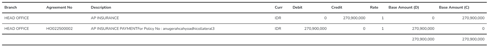

## 📄 Langkah Implementasi Report

### 1. Buat `DataGrid` Component

**Tujuan:** Menampilkan daftar report berdasarkan modul (misalnya `Report > Transaction`).

#### 🔍 Cek Submenu

-   Pastikan sudah ada submenu `Transaction` di menu `Report`.
-   Kalau belum, ikuti langkah-langkah berikut:

#### 🧾 Daftarin Role Access

-   Tambahkan konfigurasi akses di **Config (IFINSYS)**.
    -   Contoh:
        
        

#### ⚙️ Buat Komponen `DataGrid`

**Struktur folder:**

```txt
Components
└── Report
    └── TransactionComponent
        └── TransactionDataGrid.razor / .razor.cs
```

`


##### TransactionDataGrid.razor

```razor
<RadzenStack Gap="16">
  <DataGrid ID="TransactionDataGrid"
            @ref="@dataGrid"
            TItem="JsonObject"
            LoadData="LoadData"
            AllowSelected="true"
            RowLink=@((row) => $"/systemsetting/menu/{row["ReportCode"]?.ToString()}/{ParamReportName}")>

    <Columns>
      <DataGridColumn TItem="JsonObject" Property="ReportName" Title="Report Name" Width="100%" />
    </Columns>

  </DataGrid>
</RadzenStack>
```

##### TransactionDataGrid.razor.cs

```cs
using System.Text.Json.Nodes;
using iFinancing360.UI.Components;
using iFinancing360.UI.Helper.APIClient;
using Microsoft.AspNetCore.Components;

namespace IFinancing360_ACC_UI.Components.Report.TransactionComponent
{
  public partial class TransactionDataGrid
  {
    #region Service
    [Inject] IFINSYSClient IFINSYSClient { get; set; } = null!;
    #endregion

    #region Component field
    DataGrid<JsonObject> dataGrid = null!;
    #endregion

    #region Variables
    public string ParamReportName {
        get => string.Join('_', row["ReportName"]?.GetValue<string>().Split(' ', StringSplitOptions.Empty));
    }
    #endregion

    #region LoadData
    protected async Task<List<JsonObject>?> LoadData(DataGridLoadArgs args)
    {
      var res = await IFINSYSClient.GetRows<JsonObject>("SysUserMainReport", "GetRows", new { args.Keyword, args.Offset, args.Limit, userID = GetCurrentUser() });

      return res?.Data;
    }
    #endregion
  }
}
```

---

### 2. Buat `Form` Component

**Tujuan:** Menyediakan halaman filter/form berdasarkan `ReportCode`.
Per masing-masing report itu pasti punya halaman form yang berisi filter untuk data yang akan dicetak.

```razor
<TemplateForm Submit="OnPrintReport">
  <RadzenStack Gap="16">
    <!-- #region Toolbar -->
    <RadzenRow Gap="8">
      <RoleAccess Code="">
        <ButtonPreview
            ButtonStyle="ButtonStyle.Info"
            Text="Print Voucher"
            Icon="Print"
            Template="@GetReportHTML"
            PrintAs="ReportPrint" />
      </RoleAccess>

      <Button ButtonStyle="ButtonStyle.Danger" Text="Back" Click="Back" />
    </RadzenRow>
    <!-- #endregion -->

    <RadzenStack Gap="8">
      <RadzenRow Gap="32">


      <!-- !!! Cuma Template (bisa dihapus) !!! -->

      <!-- #region Accounting Period -->
        <FormFieldDatePicker Label="Accounting Period" Name="AccountingPeriod" Value=@(row["AccountingPeriod"]?.GetValue<DateTime>()) Required />
      <!-- #endregion -->

      <!-- #region Account No -->
      <FormFieldTextBox Label="Account No" Name="AccountNo" Value=@(row["AccountNo"]?.GetValue<string>()) Required />
      <!-- #endregion -->

      <!-- !!! Cuma Template (bisa dihapus) !!! -->


      </RadzenRow>
    </RadzenStack>
  </RadzenStack>
</TemplateForm>
```

#### 🧠 Catatan:

-   Field input bisa berbeda-beda tergantung kebutuhan report (lihat di Google Sheet).
-   Komponen ini dibuat per report, jadi bisa banyak form terpisah.er per masing-masing filter (lihat di google sheet)

```cs
using System.Text.Json.Nodes;
using iFinancing360.UI.Helper.APIClient;
using Microsoft.AspNetCore.Components;

namespace IFinancing360_ACC_UI.Components.Report.TrialBalanceComponent
{
  public partial class TrialBalanceForm
  {
    #region Service
    [Inject] IFINSYSClient IFINSYSClient { get; set; } = null!;
    #endregion

    #region Parameter
    [Parameter, EditorRequired] public string? ReportCode { get; set; }
    #endregion

    #region Component field
    #endregion

    #region Class field
    private const string BASE_PATH = "/base/path";

    public JsonObject row = [];
    #endregion

    #region API Controllers & routes
    //controllers
    private string APIController = "";
    //routes
    private string APIRouteFor = "";
    #endregion

    #region OnInit
    protected override async Task OnParametersSetAsync()
    {
      await base.OnParametersSetAsync();
    }
    #endregion

    #region Back
    public void Back()
    {
      NavigationManager.NavigateTo(BASE_PATH);
    }
    #endregion

    /*
        Notes ini bisa dihapus.
        IFINFINClient itu diganti dengan module/service sekarang
        ControllerName, RouteName => bisa disesuaikan untuk function yang mengembalikan html content dan data reportnya
    */
    #region GetReportHTML
    private async Task<string> GetReportHTML()
    {
      Loading.Show();

      var result = await IFINFINClient.GetRow("ControllerName", "RouteName", new { ReffNo = row["Code"]?.GetValue<string>() });
      string html = result?.Data["HTML"]?.GetValue<string>();

      Loading.Close();

      return html;
    }
    #endregion

    #region PrintReport
    private async Task PrintReport(string mimeType)
    {
      Loading.Show();

      var result = await IFINFINClient.GetRow("ControllerName", "RouteName", new { MimeType = mimeType, ReffNo = row["Code"]?.GetValue<string>() });

      if (result?.Data != null)
      {
        var data = result.Data;

        var Content = data["Content"]?.GetValueAsByteArray();
        var FileName = data["Name"]?.GetValue<string>();
        var MimeType = data["MimeType"]?.GetValue<string>();

        PreviewFile(Content, FileName, MimeType);
        Loading.Close();
      }
    }
    #endregion
  }
}
```

> Notes: Component di atas dibuat baru, sehingga kemungkinan besar tidak ditambahkan

### 3. Buat `List Page` dan `Form Page`

-   buat list page dulu
    

#### 📄 List Page

```razor
@page "/report/reporttransaction"

@using IFinancing360_ACC_UI.Components.Report.TransactionComponent

<ReleaseLock />

<Title Text="Report Transaction" />

<RoleAccess Code="">
  <PageContainer>
    <TransactionDataGrid />
  </PageContainer>
</RoleAccess>
```

#### 🧾 Form Page Berdasarkan ReportCode

    
    untuk component yang dirender akan tergantung pada **report code** yang diberikan lewat **route param**

```razor
@page "/report/reporttransaction/{ReportCode}/{ReportName}"

@using IFinancing360_ACC_UI.Components.Report.TrialBalanceReportComponent

<Title Text=@FormattedReportName />

<RoleAccess Code="">
  <PageContainer>

    @if (ReportCode == "trial_balance")
    {
      <TrialBalanceReportForm ReportCode=@ReportCode />
    } else {
      @* Kondisi kedua dan seterusnya *@
    }

  </PageContainer>
</RoleAccess>

@code {
  [Parameter] public string? ReportCode { get; set; }
  [Parameter] public string? ReportName { get; set; }

  public string? FormattedReportName =>
  string.Join(' ', ReportName.Split('_')) ?? "Report Transaction Info";
}
```

---

### 4. Tambahkan Template HTML untuk Report

> Disclaimer: emplate ini sebagai contoh, karena tampilan di previewnya nanti bisa berbeda tergantung request/kebutuhan

#### ✅ Setup `.env`

Pastikan sudah ada path ke folder template di `.env` (kalo udah ada gausah ditambahin lagi ya :))

```env
REPORT_TEMPLATE_PATH=..\ReportTemplate
```

#### 📁 Buat File `.html` Template

-   Lokasi: `/ReportTemplate`
-   Nama file bebas, sesuaikan dengan nama report-nya.
    

-   ini hanya sebagai contoh isi dari template html, tambahkan css-nya di tag style di dalam header

```html
<!DOCTYPE html>
<html lang="en">
    <head>
        <meta charset="UTF-8" />
        <meta
            name="viewport"
            content="width=device-width, initial-scale=1.0"
        />
        <title>Journal Transaction</title>
        <style>
            body {
                font-family: "Times New Roman", Times, serif;
            }

            .text-center {
                text-align: center !important;
            }

            .text-right {
                text-align: right !important;
            }

            .container {
                width: 80%;
                margin: 0 auto;
            }

            .container .header h1 {
                text-align: center;
            }

            .header,
            .section {
                margin-bottom: 20px;
            }

            .section h2 {
                margin-bottom: 10px;
                font-weight: 700;
                font-size: 24px;
            }

            .section.information {
                margin-bottom: 50px;
            }

            .section p {
                margin: 5px 0;
                font-size: 14px;
                padding-top: 3px;
            }

            table {
                width: 100%;
                border-collapse: collapse;
                margin-top: 20px;
            }

            table,
            th,
            td {
                border: 1px solid black;
            }

            th,
            td {
                padding: 8px;
                text-align: left;
            }
        </style>
    </head>

    <body>
        <div class="container">
            <div>
                <p
                    style="text-align: center;font-size: 20px; font-weight: bold;"
                >
                    {{Atribut1}}
                </p>
                <p
                    style="text-align: center;font-size: 18px; font-weight: bold;"
                >
                    {{Atribut2}}
                </p>
                <br />
            </div>
            <br />
            <div class="section-information">
                <p
                    style="font-size: 16px; font-weight: bold;margin-bottom: 6px;"
                ></p>
                <div>
                    <table
                        style="border: none; border-collapse: collapse; width: 100%;"
                        class="data-information"
                    >
                        <tr style="border: none; ">
                            <td style="border: none;width: 30%;">Atribut 3</td>
                            <td
                                style="border: none;width: 5%;text-align: center;"
                            >
                                :
                            </td>
                            <td style="border: none;width: 30%;">
                                {{Atribut3}}
                            </td>
                            <td style="border: none;width: 30%;">Atribut 4</td>
                            <td
                                style="border: none;width: 5%;text-align: center;"
                            >
                                :
                            </td>
                            <td style="border: none;width: 30%;">
                                {{Atribut4}}
                            </td>
                        </tr>
                    </table>
                </div>
            </div>
        </div>

        <div>
            <br />
        </div>

        <!-- section data -->
        <div>
            <div style="padding-top: 18px;">
                <div id="dynamicData">
                    <!-- Data -->
                </div>
            </div>
        </div>
        <!-- section data -->

        <div
            style="display: flex; justify-content: flex-end; margin-top: 20px;"
        >
            <table style="border:1px solid black; width: 50%;">
                <thead>
                    <tr>
                        <th
                            style="font-weight:bold; width: 25%; text-align: center;"
                        >
                            Prepared
                        </th>
                        <th
                            style="font-weight:bold; width: 25%; text-align: center;"
                        >
                            Checked
                        </th>
                        <th
                            style="font-weight:bold; width: 25%; text-align: center;"
                        >
                            Approved
                        </th>
                        <th
                            style="font-weight:bold; width: 25%; text-align: center;"
                        >
                            Posted
                        </th>
                    </tr>
                </thead>
                <tbody>
                    <tr>
                        <td
                            style="text-align:left; width: 25%; height: 70px;"
                        ></td>
                        <td
                            style="text-align:left; width: 25%; height: 70px;"
                        ></td>
                        <td
                            style="text-align:left; width: 25%; height: 70px;"
                        ></td>
                        <td
                            style="text-align:left; width: 25%; height: 70px;"
                        ></td>
                    </tr>
                </tbody>
            </table>
        </div>
    </body>
</html>
```

> Pro Tip: Mau ngedesain HTML lebih gampang? Gunain [CodePen](https://codepen.io/pen/) buat preview cepat!

### 1. Struktur dan Pengambilan Data (Repository)

> ⚠️ **Catatan**: Data yang digunakan dalam report _tidak selalu_ berasal dari satu repository. Bisa lebih dari satu, tergantung kebutuhan. Jadi jangan asumsikan semuanya berasal dari satu source.

```cs
// Hanya template untuk referensi, implementasi bisa berbeda tergantung kebutuhan.
```

### 2. Implementasi Backend

#### 2.1 Tambahkan Logic di Layer Controller dan Service

-   Logic utama untuk mengambil data dari repository dan mengganti isi template HTML dilakukan di dalam service.
-   Controller hanya bertugas sebagai endpoint pemanggil service.

#### 2.2 Contoh Implementasi Service - `GetHTMLPreview`

```cs
#region PreviewHTML
public async Task<string> GetHTMLPreview(string reffNo)
{
    using var connection = _repo.GetDbConnection();
    using var transaction = connection.BeginTransaction();

    try
    {
      // Ambil isi file template HTML
      string envPath = Env.GetString("REPORT_TEMPLATE_PATH"); // Sesuaikan dengan atribut di env
      string templatePath = Path.Combine(envPath, "JournalTransaction.html"); // Sesuaikan dengan nama templatenya
      string htmlContent = await File.ReadAllTextAsync(templatePath);

      // Isi data untuk table atas (header) (ada keterangan table atas di bawah code snippet, ingat ini hanya contoh)
      // Data dinamis yang ingin disuntikkan ke dalam template
      var parameters = new Dictionary<string, string>
      {
          { "Atribut_1", string.Empty },
      };

      // Gantikan placeholder dengan nilai dari dictionary
      foreach (var parameter in parameters)
      {
          string placeholder = $"{{{{{parameter.Key}}}}}";
          htmlContent = htmlContent.Replace(placeholder, parameter.Value);
      }


      // Isi data di table bawah (ada keterangan table bawah di bawah code snippet, ingat ini hanya contoh)
      List<JournalGlLinkTransactionDetail> dataList = [];

      string queryHtml = string.Empty;

      queryHtml += $@"
        <table style=""border-collapse: collapse; width: 100%; border:none"">
            <thead>
                <tr style=""border-top: 2px solid black; border-bottom: 2px solid black;"">
                    <th style=""font-weight:bold; padding: 8px; border: none;"">Column 1</th>
                    <th style=""font-weight:bold; padding: 8px; border: none;"">Column 2</th>
                </tr>
            </thead>
            <tbody>";

        // Ini untuk isi data yang ada di tabelnya
      foreach (var item in dataList)
      {
          queryHtml += $@"
            <tr style=""border-bottom: 1px solid black;"">
                <td style=""text-align:left;  border: none;"">{item.Column1}</td>
                <td style=""text-align:left;  border: none;"">{item.Column2}</td>
            </tr>";
      }

      queryHtml += $@"
            </tbody>
        </table>";


      htmlContent = htmlContent.Replace("<!-- Data -->", queryHtml);
      return htmlContent;
    }
    catch (Exception)
    {
      transaction.Rollback();
      throw;
    }
}
#endregion

#region GenerateDocumentAllType
public async Task<FileDoc> GenerateDocumentAllType(string mimeType, string reffNo)
{
    using var connection = _repo.GetDbConnection();
    using var transaction = connection.BeginTransaction();

    try
    {
      // Ambil isi file template HTML
      string envPath = Env.GetString("REPORT_TEMPLATE_PATH"); // Sesuaikan dengan atribut di env
      string templatePath = Path.Combine(envPath, "JournalTransaction.html"); // Sesuaikan dengan nama templatenya
      string htmlContent = await File.ReadAllTextAsync(templatePath);

      // Isi data untuk table atas (header) (ada keterangan table atas di bawah code snippet, ingat ini hanya contoh)
      // Data dinamis yang ingin disuntikkan ke dalam template
      var parameters = new Dictionary<string, string>
      {
          { "Atribut_1", string.Empty },
      };

      // Gantikan placeholder dengan nilai dari dictionary
      foreach (var parameter in parameters)
      {
          string placeholder = $"{{{{{parameter.Key}}}}}";
          htmlContent = htmlContent.Replace(placeholder, parameter.Value);
      }


      // Isi data di table bawah (ada keterangan table bawah di bawah code snippet, ingat ini hanya contoh)
      List<JournalGlLinkTransactionDetail> dataList = [];

      string queryHtml = string.Empty;

      queryHtml += $@"
        <table style=""border-collapse: collapse; width: 100%; border:none"">
            <thead>
                <tr style=""border-top: 2px solid black; border-bottom: 2px solid black;"">
                    <th style=""font-weight:bold; padding: 8px; border: none;"">Column 1</th>
                    <th style=""font-weight:bold; padding: 8px; border: none;"">Column 2</th>
                </tr>
            </thead>
            <tbody>";

        // Ini untuk isi data yang ada di tabelnya
      foreach (var item in dataList)
      {
          queryHtml += $@"
            <tr style=""border-bottom: 1px solid black;"">
                <td style=""text-align:left;  border: none;"">{item.Column1}</td>
                <td style=""text-align:left;  border: none;"">{item.Column2}</td>
            </tr>";
      }

      queryHtml += $@"
            </tbody>
        </table>";


      htmlContent = htmlContent.Replace("<!-- Data -->", queryHtml);

        MemoryStream memoryStream = new();

        if (mimeType == null) throw new ArgumentNullException("Mime Type is null");

        if (mimeType == "Docx")
        {
            memoryStream = Report.ConvertHtmlToDocx(htmlContent);
            mimeTypetoReturn = "application/vnd.openxmlformats-officedocument.wordprocessingml.document";
        }
        if (mimeType == "Xlsx")
        {
            memoryStream = Report.ConvertHTMLtoExcel(htmlContent);
            mimeTypetoReturn = "application/vnd.openxmlformats-officedocument.spreadsheetml.sheet";
        }
        if (mimeType == "PDF")
        {
            mimeTypetoReturn = "application/pdf";
            memoryStream = Report.ConvertHtmlToDocx(htmlContent);

            // Konversi memoryStream (DOCX) ke byte array
            byte[] docxBytes;
            using (var ms = new MemoryStream())
            {
                memoryStream.CopyTo(ms);
                docxBytes = ms.ToArray();
            }

            // Convert DOCX ke PDF
            byte[] pdfBytes = await ConvertDocxToPDF(docxBytes);
            memoryStream = new MemoryStream(pdfBytes);
        }

        FileDoc fileDoc = new()
        {
            Content = memoryStream.ToArray(),
            Name = $"JOURNAL_TRANSACTION.{mimeType}",
            MimeType = mimeTypetoReturn,
        };

        return fileDoc;
    }
    catch (Exception)
    {
        transaction.Rollback();
        throw;
    }
}
#endregion
```

keterangan:

-   Tabel atas => biasanya header untuk data perusahaan / report
    

-   Table bawah => isinya data intinya dan jumlahnya banyak
    

---

#### 2.3 Contoh Implementasi Controller

```cs
[HttpGet("GetHTMLPreview")]
public async Task<ActionResult> GetPreview(string ReffNo)
{
    try
    {
        var result = await _service.GetHTMLPreview(ReffNo);
        return ResponseSuccess(new { HTML = result });
    }
    catch (Exception ex)
    {
        return ResponseError(ex);
    }
}

[HttpGet("PrintDocumentAllType")]
public async Task<ActionResult> PrintDocument(string MimeType, string ReffNo)
{
    try
    {
    var content = await _service.GenerateDocumentAllType(MimeType, ReffNo);
    return ResponseSuccess(content);
    }
    catch (Exception ex)
    {
    return ResponseError(ex);
    }
}
```

> 💡 _Note_: Penggunaan `_internalAPIClient` hanya diperlukan jika ingin mengambil data dari modul lain.

---

### 3. Tampilan UI (Frontend)

#### 3.1 Tambahkan Button di UI

Gunakan komponen `<ButtonPreview />` untuk menampilkan tombol yang akan memicu preview report.

```razor
<ButtonPreview
    Text="Print Voucher"
    Icon="Print"
    ButtonStyle="ButtonStyle.Info"
    Template="@GetHTMLForPreview"
    PrintAs="PrintReport"
/>
```

#### 3.2 Implementasi Function Preview HTML

```cs
#region Preview report
private async Task<string> GetHTMLForPreview()
{
    Loading.Show();

    var result = await IFINFINClient.GetRow(
        "JournalGlLinkTransaction",
        "GetHTMLPreview",
        new { ReffNo = row["Code"]?.GetValue<string>() }
    );

    string html = result?.Data["HTML"]?.GetValue<string>();

    Loading.Close();

    return html;
}
#endregion

#region PrintReport
private async Task PrintReport(string mimeType)
{
    Loading.Show();

    var result = await IFINACCClient.GetRow("JournalGlLinkTransaction", "PrintDocumentAllType", new { MimeType = mimeType, ReffNo = row["Code"]?.GetValue<string>() });
    if (result?.Data != null)
    {
    var data = result.Data;

    var Content = data["Content"]?.GetValueAsByteArray();
    var FileName = data["Name"]?.GetValue<string>();
    var MimeType = data["MimeType"]?.GetValue<string>();

    PreviewFile(Content, FileName, MimeType);
    Loading.Close();
    }
}
#endregion
```
